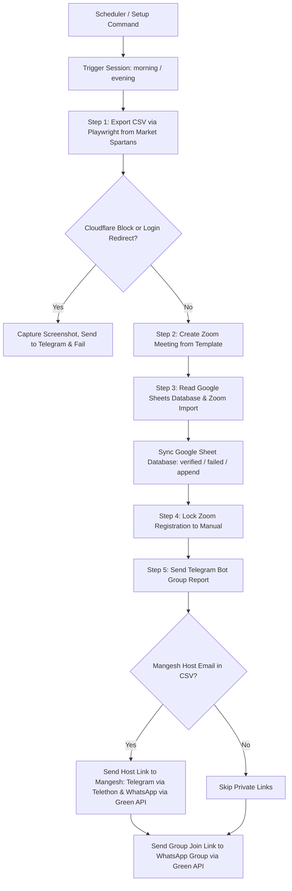

# Agent Guidelines & Project Architecture: Market Spartans Automation

This document serves as the absolute source of truth for understanding, running, maintaining, and debugging the Market Spartans Zoom automation system. Any AI agent or developer working on this codebase must adhere strictly to these guidelines and design patterns.

---

##  Table of Contents
1. [Overview & Purpose](#1-overview--purpose)
2. [System Architecture & Workflow](#2-system-architecture--workflow)
3. [Component & Integration Details](#3-component--integration-details)
4. [Environment Configuration (Secrets & Variables)](#4-environment-configuration-secrets--variables)
5. [Operational Workflows](#5-operational-workflows)
6. [Recurrent Bugs & Troubleshooting Guide](#6-recurrent-bugs--troubleshooting-guide)
7. [Critical Repository Rules](#7-critical-repository-rules)

---

## 1. Overview & Purpose

The **Market Spartans Automation** system is a Python-based utility that automates daily administrative tasks for virtual trading webinars run by Mangesh Kale. 

Its primary functions are:
- **Scraping/Exporting**: Exporting daily registered users from the Market Spartans admin portal.
- **Meeting Management**: Auto-creating Zoom meetings from a predefined template.
- **Verification & Syncing**: Cross-referencing registered users with a Google Sheet database ("Zoom Verified Users") and auto-registering them to the newly created Zoom meeting.
- **Notifications & Access Control**: Locking the Zoom meeting to manual approval after registrations are imported, sending user join links to a WhatsApp group, and sending host links directly to the host (Mangesh Kale) via Telegram (using Telethon) and WhatsApp (using Green API).

The service is designed to run 24/7 on a cloud platform (currently hosted on **Railway**), operating on a scheduled basis (Morning & Evening sessions) corresponding to Indian Standard Time (IST).

---

## 2. System Architecture & Workflow

The system is automated using `apscheduler` and a Telegram Bot interface. The workflow execution follows a strict sequence:



### 1. Daily Schedule & Triggers
* **Midnight Reset**: At `00:00 IST`, the pre-approval cache resets.
* **Morning Session**: Confirms at `08:30 IST` (Meeting starts at morning time).
* **Evening Session**: Confirms at `16:30 IST` (Meeting starts at evening time).
* **Confirmation Loop**: At the scheduled time, unless **Pre-Approved** (Fast-Pass Setup), the bot sends an interactive message to the admin group with buttons: **[Yes, run it]** and **[Skip for today]**. If no response is received within 15 minutes, it automatically skips the session.

### 2. Execution Phase
1. **Export CSV (Playwright)**: Logs into the Market Spartans portal and downloads the registered participant CSV.
2. **Create Zoom Meeting**: Fetches a Zoom OAuth token and creates a 6-hour Zoom meeting.
3. **Database Sync & Import**: Cross-references the CSV against a Google Sheets database to handle custom mapped Zoom emails, registers users on Zoom, updates the sheet statuses, and adds any new users.
4. **Lock Registration**: Switches the Zoom meeting settings to manual approval.
5. **Routing & Dispatch**: Sends a summary report to Telegram. If Mangesh is in the attendee CSV, he receives the host link via private Telegram (Telethon) and WhatsApp. The group join link is posted to the WhatsApp group.

---

## 3. Component & Integration Details

### A. Playwright (Market Spartans Portal Scraper)
* **Target Pages**: Login via `/index.php` and export via `/export-users.php` (for morning/evening links).
* **Bypassing Bot Detection**: Uses headless Chromium with args `--disable-blink-features=AutomationControlled` and a mock User-Agent to avoid simple bot mitigations.
* **Retry Loop**: Operates on a 3-try retry loop with a 10-second delay between attempts. If the 3rd attempt fails, it captures a full-page screenshot to `/tmp/failed_{session_type}.png` and uploads it to Telegram.

### B. Zoom API (Server-to-Server OAuth)
* **Auth Endpoint**: `https://zoom.us/oauth/token` with parameters `grant_type=account_credentials` and `account_id` sent via HTTP Basic Auth (`client_id` and `client_secret`).
* **Meeting Creation**: `POST /users/me/meetings` with template mapping (`template_id`).
* **Locking**: `PATCH /meetings/{meeting_id}` dynamically updating settings `approval_type=1` (manual approval).

### C. Google Sheets Database (gspread)
* **Sheet Name**: `"Zoom Verified Users"` (Sheet 1).
* **Schema Layout**:
  * **Column A**: `Original Email` (used as primary key/lookup).
  * **Column B**: `Zoom Email` (used if a registrant logs in with a different email).
  * **Column C**: `Name`.
  * **Column D**: `Status` (`Verified` / `Failed`).
* **Sync Strategy**: Reads all rows into memory at the beginning. If an original email exists but status changed, it triggers a `batch_update`. If new, it appends a row.

### D. Telethon (Telegram User Client)
* **Purpose**: Telethon acts as a *Userbot* executing actions from the developer's personal Telegram account, sending the private host link directly to Mangesh.
* **Auth**: Authenticates using a pre-generated `TELETHON_SESSION` string (stored in Railway env variables) along with `api_id` and `api_hash`.
* **Contact Number**: Mangesh's Telegram contact phone number is hardcoded as `+919922997314` (Note: `SETUP_TOMORROW.md` lists `+919922995956` for references, but code executes targeting `+919922997314`).

### E. Green API (WhatsApp Gateway)
* **Purpose**: Automates sending messages to WhatsApp.
* **Integrations**:
  * **Group message**: Sends the Zoom registration link to the configured WhatsApp group ID (`WHATSAPP_GROUP_ID`).
  * **Private message**: Sends the host link directly to Mangesh's WhatsApp (`919922997314@c.us`) via `/sendMessage`.

---

## 4. Environment Configuration (Secrets & Variables)

The following variables must be configured on Railway:

| Category | Variable Name | Description | Example / Format |
|---|---|---|---|
| **Market Spartans** | `MS_USERNAME` | Admin portal username | `admin_user` |
| | `MS_PASSWORD` | Admin portal password | `********` |
| | `MORNING_SITE_URL` | Base URL of Morning Spartans site | `https://morning.example.com` |
| | `MORNING_EXPORT_URL` | CSV export URL for Morning session | `https://morning.example.com/export.php` |
| | `MORNING_MEETING_TIME`| Meeting start time (IST) | `09:00:00` |
| | `EVENING_SITE_URL` | Base URL of Evening Spartans site | `https://evening.example.com` |
| | `EVENING_EXPORT_URL` | CSV export URL for Evening session | `https://evening.example.com/export.php` |
| | `EVENING_MEETING_TIME`| Meeting start time (IST) | `17:00:00` |
| **Zoom API** | `ZOOM_ACCOUNT_ID` | Zoom Server-to-Server account ID | `abc123xyz...` |
| | `ZOOM_CLIENT_ID` | Zoom app client ID | `xyz...` |
| | `ZOOM_CLIENT_SECRET` | Zoom app client secret | `sec_abc123...` |
| | `ZOOM_TEMPLATE_ID` | Template ID used to spawn meetings | `987654321` |
| **Telegram Bot** | `TELEGRAM_BOT_TOKEN` | Token for the interactive bot | `123456789:ABC...` |
| | `TELEGRAM_CHAT_ID` | Target Admin Telegram chat ID (group/channel) | `-100223456789` |
| **Telethon** | `TELETHON_API_ID` | Telegram API ID (numeric) | `2394857` |
| | `TELETHON_API_HASH` | Telegram API Hash | `abcd1234efgh...` |
| | `TELETHON_SESSION` | Telethon Session String | `1BJWap12...` (generated via helper script) |
| **Green API** | `GREENAPI_INSTANCE_ID`| Green API Instance ID | `1101822...` |
| | `GREENAPI_TOKEN` | Green API Instance Token | `abcdef123456...` |
| | `WHATSAPP_GROUP_ID` | WhatsApp target group JID | `12036312345678@g.us` |
| **Google Sheets**| `GOOGLE_CREDENTIALS` | Raw JSON string of Service Account credentials | `{"type": "service_account", ...}` |

---

## 5. Operational Workflows

### A. Development & Testing
To verify script functionality without sending emails, spamming groups, or keeping meetings, run:
```bash
# Test the Morning workflow (deletes Zoom meeting when finished)
/test morning

# Test the Evening workflow (deletes Zoom meeting when finished)
/test evening
```
*Note: Test commands must be issued inside the Telegram bot chat.*

### B. One-Time Setup Helpers
* **Telethon Session Generation**: Run [generate_session.py](file:///Users/sohambhutkar/projects/Automation/Market_Spartans_/generate_session.py) locally to walk through Telegram's OTP authentication flow and retrieve the `TELETHON_SESSION` string.
* **WhatsApp Group ID Extraction**: Run [get_whatsapp_group_id.py](file:///Users/sohambhutkar/projects/Automation/Market_Spartans_/get_whatsapp_group_id.py) to fetch all active chats/groups and extract the `@g.us` JID string for Railway configuration.

### C. Fast-Pass / Pre-approvals (`/setup`)
Send `/setup` in the Telegram Bot chat to pre-approve the current day's runs. 
* Options: "Morning Only", "Evening Only", "BOTH Sessions".
* Pre-approved sessions run instantly when the scheduled trigger occurs, completely bypassing the confirmation message and the 15-minute timeout.

---

## 6. Recurrent Bugs & Troubleshooting Guide

### ❌ `Locator.click: Timeout 30000ms exceeded`
This is the most common issue encountered by the runner. It occurs during `export_csv(session_type)` in Playwright when waiting for the `Export for Zoom` button.

#### Root Causes
1. **Silent Login Failure**: If session credentials expire, the application is redirected back to `/index.php`. Since there is no `Export for Zoom` button there, Playwright times out waiting.
2. **Cloudflare / IP Ban (WAF blocks)**: Target site protection (Cloudflare) frequently blocks Railway hosted IP addresses. When this happens, a Captcha or "Just a moment..." verification page is served instead of the login portal.
3. **Flaky Navigation Redirects**: Playwright can experience race conditions if navigating prior to completing login redirects.

#### Resolutions & Mitigations (Active in Code)
* **CF Page Title Detections**: The code checks `page.title()` for "Cloudflare", "Attention Required!", or "Just a moment..." and raises a clean exception immediately, saving execution time.
* **Error Text Extraction**: If redirected to `/index.php` post-login, the code queries classes `.alert-danger`, `.error`, and `.text-danger` to pull the raw error message (e.g. "Invalid Password") and outputs it to Telegram.
* **Telegram Failure Screenshots**: On the 3rd final retry failure, Playwright takes a full-page screenshot of the screen state. The bot sends this screenshot to Telegram. **Do not remove this logic**; it is the only way to confirm if Cloudflare is blocking the IP.

### ❌ Database Service Account Authentication Failures
If Google Sheets API fails with auth errors:
* Verify the credentials JSON string in `GOOGLE_CREDENTIALS` env variable is correctly formatted and doesn't contain truncated JSON blocks.
* Make sure the service account email (found inside the `GOOGLE_CREDENTIALS` JSON object) is shared as an **Editor** on the Google Sheet "Zoom Verified Users".

---

## 7. Critical Repository Rules

> [!IMPORTANT]
> **Deployment & Pushing (Fork Configuration)**
> * This repository is a **fork**:
>   * `origin` is your personal fork: `https://github.com/Sohamb-Artiset/Market_Spartans_.git`
>   * `upstream` is the primary main repository: `https://github.com/Soham407/MarketSpartans.git`
> * **ALWAYS** push commits to the **`upstream`** remote, **NOT** `origin`.
> * Command: `git push upstream main`
> * **Railway builds and auto-deploys directly from the `upstream` repository's `main` branch.** Pushing to `origin` will only update your personal fork and will **NOT** trigger a live deployment.

> [!TIP]
> **Maintaining Codebase Stability**
> * Preserve screenshot recovery paths: Playwright screenshots are critical for visual debugging of Cloudflare blocks.
> * Maintain Indian Standard Time (IST) offset logic (`timedelta(hours=5, minutes=30)`) across datetime tasks.
